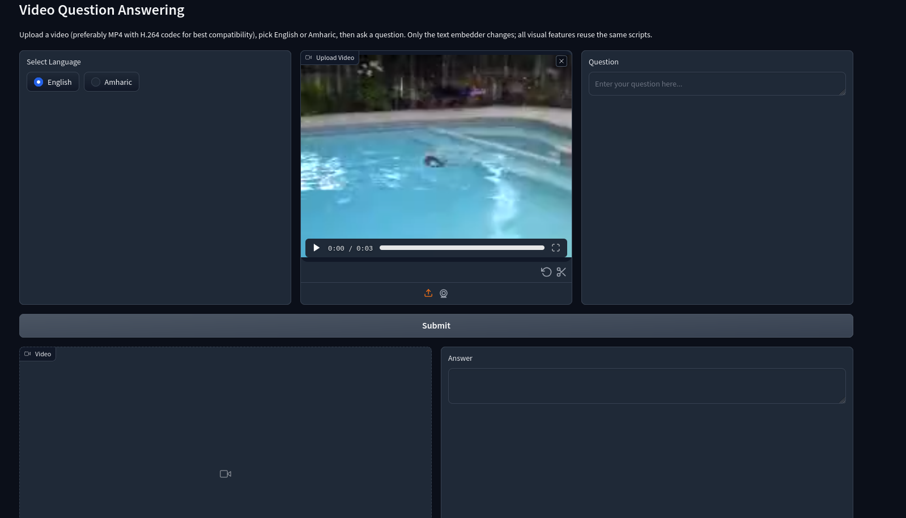

## 🤗 Download Pretrained Models

Download and place the models inside a folder named `model/`.

[](https://huggingface.co/hinaltt/Video_Question_Answering_Model_for_Amharic)
&nbsp;
[](https://huggingface.co/hinaltt/VideoQA)

---



---

## 📥 Clone the Repository

```bash
git clone https://github.com/helinatefera/VQAGen-Demo.git
cd VQAGen-Demo
````

---

## 🛠️ Setup & Run

Install all required dependencies:

```bash
pip install -r requirements.txt
```

Run the graphical interface:

```bash
python gui_live.py
```
## 🧼 License

MIT License © helinatefera


## 📞 Contact

👤 **Helina Tefera**  
✉️ [E-Mail](mailto:helinatefera1212@gmail.com)  
📱 [Phone](tel:+251929453545)
